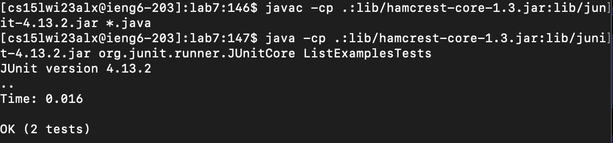

## Log into ieng6

* to log into ieng6, I entered the command `ssh cs15lwi23alx@ieng6.ucsd.edu + <enter>` and then enter the password to log my ieng6 server.
## Clone **lab7** repository from github account

* I used the ssh key to clone the repository. The command I used is `git clone git@github.com:hiiminbush/lab7.git + <enter>`
* Then I typed in `cd lab7 + <enter>` to change the working directory
## run the tests

* I typed in `javac -cp .:lib/hamcrest-core-1.3.jar:lib/junit-4.13.2.jar *.java + <enter>` to compile all the files in **lab7**
* Then I typed in `java -cp .:lib/hamcrest-core-1.3.jar:lib/junit-4.13.2.jar org.junit.runner.JUnitCore ListExamplesTests + <enter>` to run the JUnit test
## Edit the code to fix the bugs

* From the previous JUnit test we know that the code has failed which means there are bugs in the code.
* To edit code I typed `nano ListExamples.java + <enter>` in the command line and we should see the screen shown in the image
* To locate the bug I used `Ctrl + w + s + <enter>` and `Ctrl + w + index2 + <enter>` to locate the bugs and fix them
* To save I pressed: `Ctrl + o + <enter>` to save changes
* To exit I pressed: `Ctrl + x + <enter>` to exit
## Run the tests again

* For this step I pressed the following keys: <up><up><up><enter> to get the `javac -cp .:lib/hamcrest-core-1.3.jar:lib/junit-4.13.2.jar *.java` command from bash history to complile all the files
* I then pressed the following keys: <up><up><up><enter> to get the `java -cp .:lib/hamcrest-core-1.3.jar:lib/junit-4.13.2.jar org.junit.runner.JUnitCore TestListExamples` command from bash history to run the JUnit tester
* Now the code has passed the tester
## Commit and push the change to Github

* I typed in `git add ListExamples.java + <enter>` to add
* Then I typed in `git commit -m "update" + <enter>` to commit
* Then I typed in `git push + <enter>` to push changes to github

